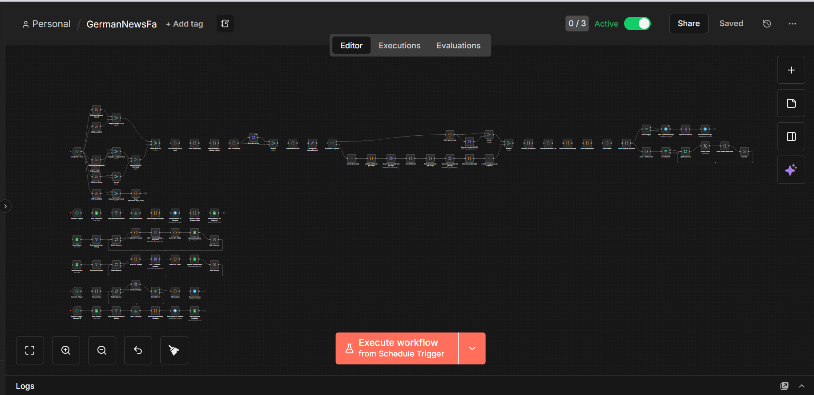
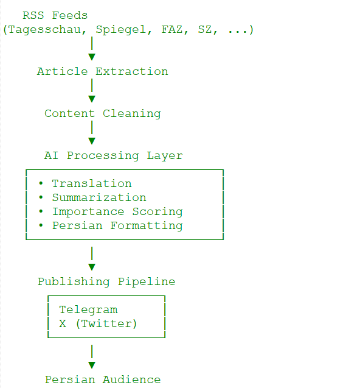
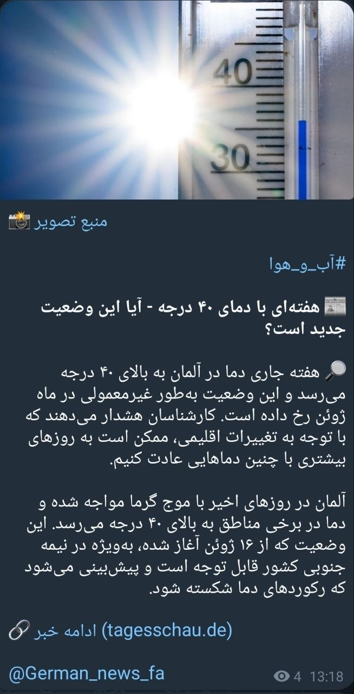
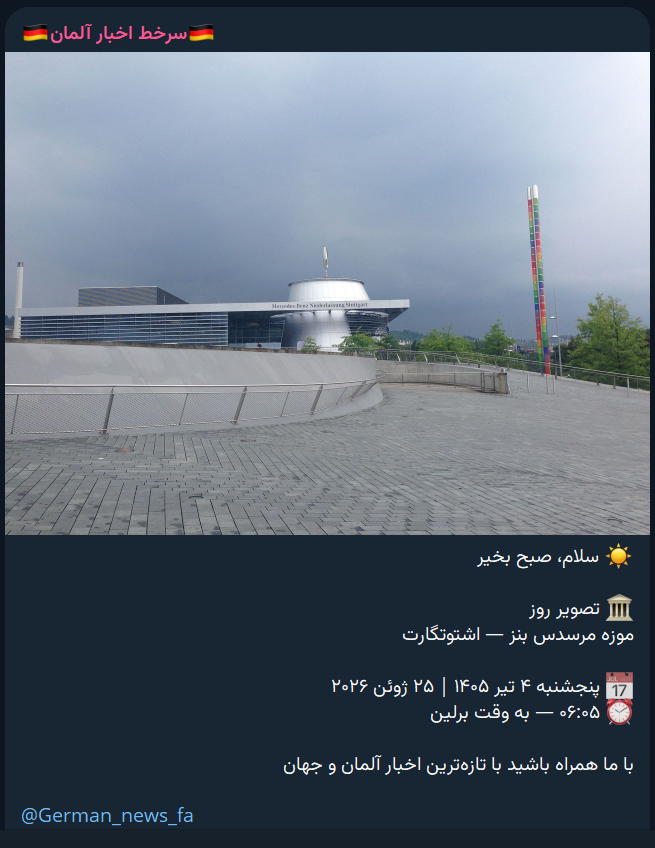
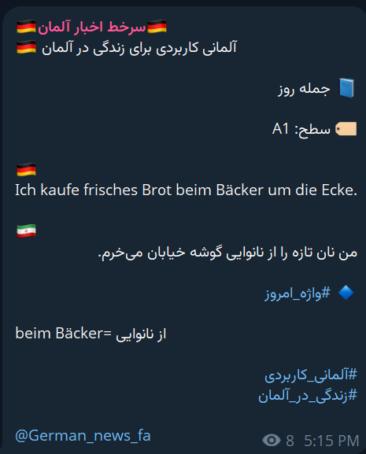
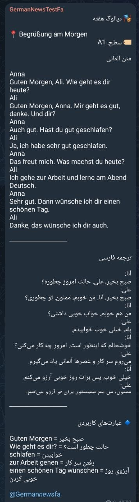
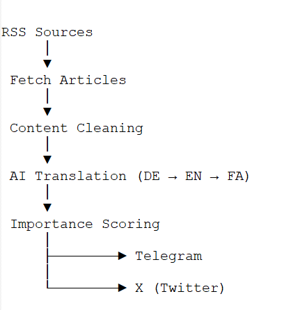
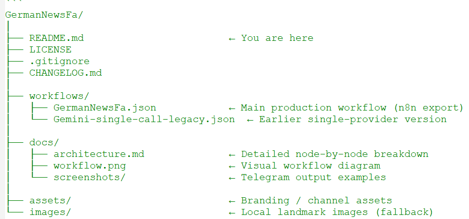

# GermanNewsFa
[](LICENSE)


> AI-Powered German News & Language Learning Automation Platform

> Production-ready AI automation platform for multilingual news publishing, German language learning, and Telegram content automation.


## n8n Workflow

<p align="center">
  
</p>

---

## System Overview

<p align="center">
  
</p>

---

## Telegram Output

<p align="center">
  
  
  
  
</p>

---

## What This Project Demonstrates

This is a production-grade AI automation system I designed and built end-to-end,
showcasing skills in:

  - **LLM Integration**       — Dynamic switching between OpenAI GPT and Google Gemini
                                via a single provider flag; structured JSON output parsing
  - **Prompt Engineering**    — Custom system prompts for consistent, high-quality
                                Farsi translations with preserved journalistic tone
  - **Workflow Orchestration**— Multi-branch parallel pipelines in n8n with error
                                handling, deduplication, and retry logic
  - **API Integration**       — Telegram Bot API, Wikimedia REST API, 6x RSS feeds,
                                OpenAI + Gemini APIs — all chained in one workflow
  - **Data Engineering**      — Stateful deduplication across runs using a database
                                backend; shuffle-bag algorithm for content rotation
  - **Scheduling & Reliability** — Three independent cron pipelines running in production,
                                   each with its own error boundary
---

## Key Technical Decisions

### Dual-LLM Architecture
The workflow abstracts the AI provider behind a single `Set provider` node.
Switching from OpenAI to Gemini requires changing one value — no other node
needs to be touched. This was a deliberate design choice for cost flexibility
and resilience against API outages.

### Stateful Deduplication
Every published article is tracked in a database. On each hourly run, incoming
RSS items are filtered against this store before any LLM call is made —
avoiding redundant API costs and duplicate posts.

### Shuffle-Bag for Content Rotation
Rather than random selection (which allows repeats), the morning image pipeline
uses a shuffle-bag: all 55+ landmarks are shuffled once, then consumed one by
one. Only when the bag is empty is a new shuffle triggered. This guarantees
full coverage before any location repeats.

### Bilingual Date Formatting (No External Library)
The morning post caption includes the Jalali (Persian) calendar date computed
natively via the JavaScript `Intl.DateTimeFormat` API with `ca-persian` locale —
no third-party library required, no external call.

### Modular Workflow Design
Each automation is implemented as an independent workflow with a single responsibility. This modular approach simplifies maintenance, testing, and future feature expansion.

---

## Pipeline Details

### 1. Hourly News Pipeline
  - Triggers: every 60 minutes
  - Sources: Spiegel, FAZ, Süddeutsche Zeitung, Focus, Tagesschau, BBC
  - Flow: RSS fetch → dedup check → GPT/Gemini translate → caption build → Telegram post
  - LLM output: structured JSON with `title_fa`, `summary_fa`, `keywords`

### 2. Daily Morning Image (06:05 Berlin Time)
  - Selects a German landmark (55+ locations across 20+ cities)
  - Downloads image from Wikimedia Commons at 1600px
  - Builds a Farsi caption with Jalali date, Gregorian date, Berlin time,
    and any German public holidays for that day
  - Posts photo + RTL-formatted caption to Telegram

### 3. Weekly German Learning Post (Saturday 10:00)
  - Reads prepared dialog entries from database
  - Formats and publishes to Telegram
  - Marks entries as published to prevent duplicates

---

## Hybrid AI Video Pipeline

The platform now includes a local video-production extension:

- Hosted n8n selects and prepares relevant German news.
- A configurable webhook forwards selected items to a local n8n instance.
- Ollama creates a validated three-scene Persian storyboard.
- ComfyUI generates vertical scene images with completion polling and timeout handling.
- Local TTS creates Persian narration.
- FFmpeg renders scenes, joins the video, mixes background music, and adds intro/outro assets.
- Telegram receives the validated final video.

See [Hybrid News-to-Video Pipeline](docs/local-video-pipeline.md) for architecture, setup, security, and current limitations.

---

## Tech Stack

| Layer            | Technology                              |
|------------------|-----------------------------------------|
| AI / LLM         | OpenAI GPT-4o, Google Gemini            |
| Workflow         | n8n                                     |
| Messaging        | Telegram Bot API                        |
| Image Source     | Wikimedia Commons REST API              |
| News Sources     | RSS (Spiegel, FAZ, SZ, Focus, ARD, BBC) |
| Database         | PostgreSQL / SQLite                     |
| Language         | JavaScript, Python                     |
| Local AI         | Ollama, ComfyUI                         |
| Video            | FFmpeg                                  |
| Connectivity     | Webhook, Cloudflare Tunnel              |

---

## Architecture Diagram

<p align="center">
  
</p>

---

## Project Structure

<p align="center">
  
</p>

---

## Setup Guide

### Prerequisites
  - Hosted n8n instance for news processing
  - Local self-hosted n8n instance for video generation
  - Ollama, ComfyUI, FFmpeg, and local TTS for the video pipeline
  - Telegram Bot Token (via @BotFather)
  - OpenAI API Key and/or Google Gemini API Key
  - PostgreSQL or SQLite database for deduplication

### Steps

1. Clone the repository:
   ```bash
   git clone https://github.com/seyedali_saghaei/GermanNewsFa.git
   cd GermanNewsFa
   ```

2. Import the workflow into n8n:
   - Open n8n → Workflows → Import from File
   - Select `workflows/GermanNewsFa.json`

3. Configure credentials in n8n (Settings → Credentials):
   - **Telegram API** — paste your Bot Token
   - **OpenAI API**   — paste your API key
   - **Gemini API**   — paste your API key (if using Gemini)
   - **Database**     — configure your connection

4. Set your AI provider:
   - Open the node `Set provider (openai|gemini)`
   - Set value to `openai` or `gemini`

5. Set your Telegram channel ID:
   - Update `chatId` in all Telegram nodes to your channel

6. Activate the workflow and monitor the first runs.

---

## Live Output

The workflow is running in production. You can see the output here:

  - Telegram: https://t.me/German_news_fa
  - Twitter/X: https://x.com/GermanNewsFa

---

## What I Would Add Next

  - **Vector deduplication** — embed article content and skip semantically similar articles, not just exact-URL duplicates
  - **Analytics dashboard** — track post engagement and auto-adjust posting times
  - **Fallback chain** — if OpenAI fails, automatically retry with Gemini
  - **Multi-language support** — extend beyond Farsi using the same pipeline

---

## License

MIT — free to use, adapt, and redistribute with attribution.

---

*Built by Seyedali Saghaei · AI Engineering & Automation*
